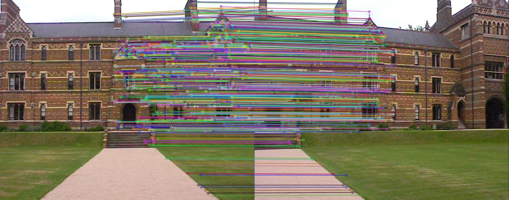

# Robust Image Stitching Pipeline

A feature-based image stitching algorithm implementing SIFT feature detection, descriptor matching, outlier rejection, and homography estimation in order to stitch 3 images together.

---

## Overview

This project implements a complete end-to-end image stitching workflow:

1. Detect keypoints in overlapping images  
2. Extract feature descriptors  
3. Perform descriptor matching  
4. Filter matches using Lowe's ratio test for thresholding
5. Estimate homography with RANSAC  
6. Warp and stitch images into a mosaic  

Each of the 3 images must be of the same resolution. There must be sufficient overlap between each of the images for SIFT to be able to pick up the features.

# Feature Matches
These are the matched features picked up by SIFT, after Lowe's ratio test.

The goal of the project was to build the full pipeline from scratch (using OpenCV primitives where appropriate) and understand each stage of geometric image alignment.

